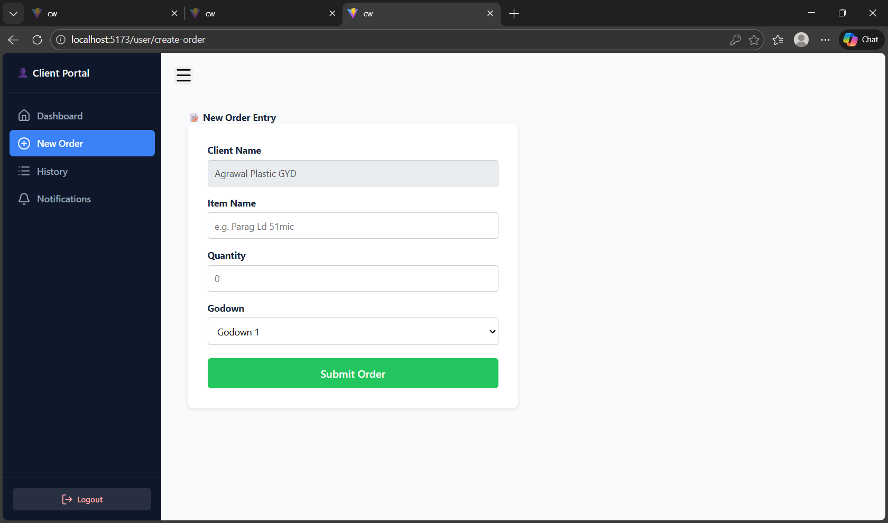
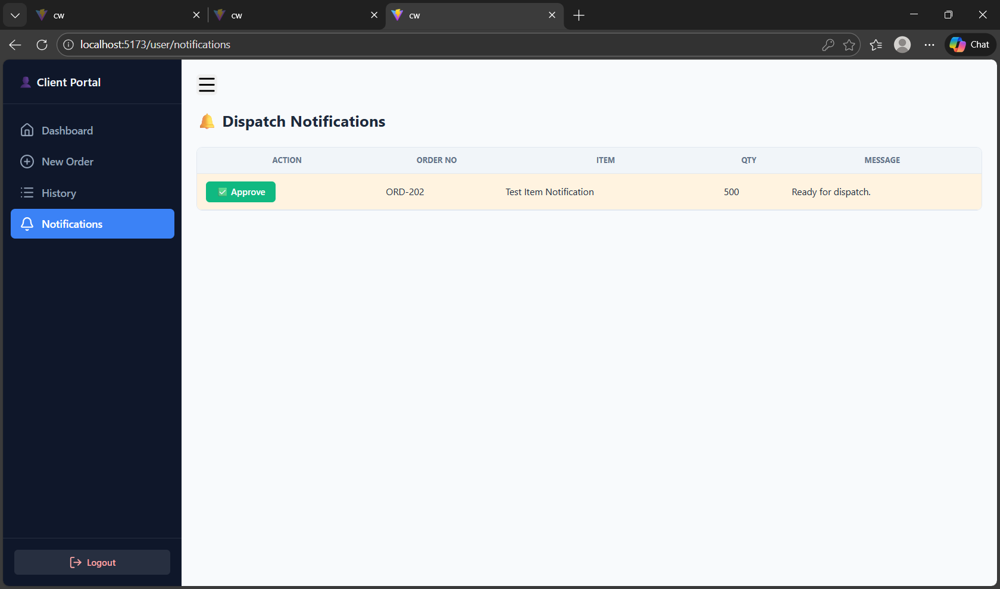
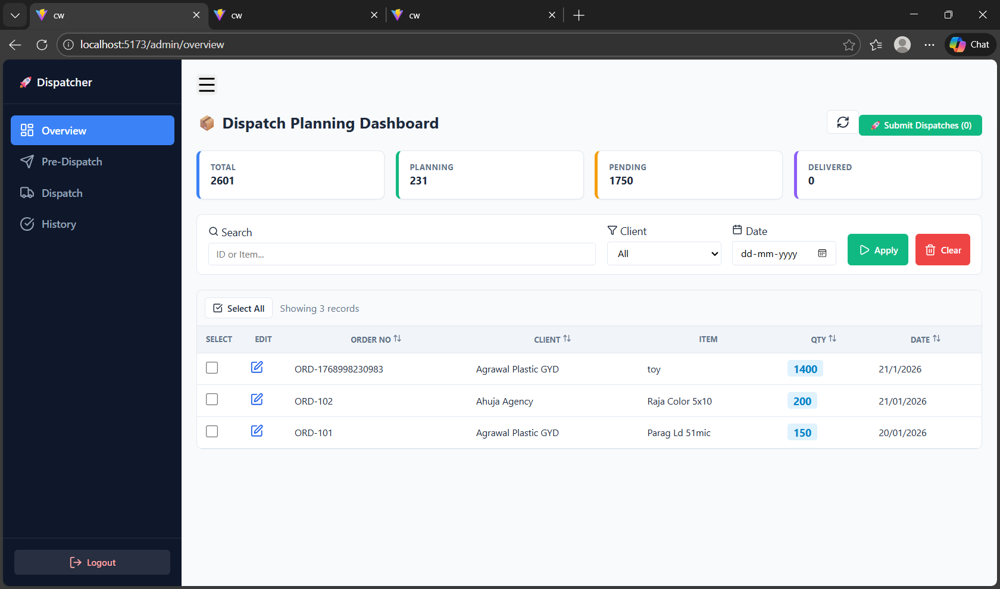
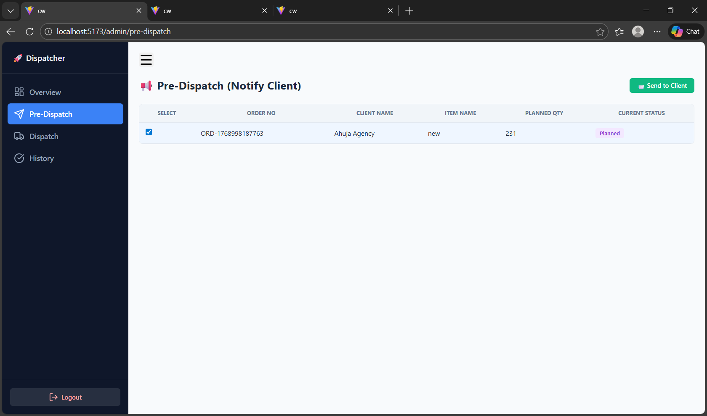
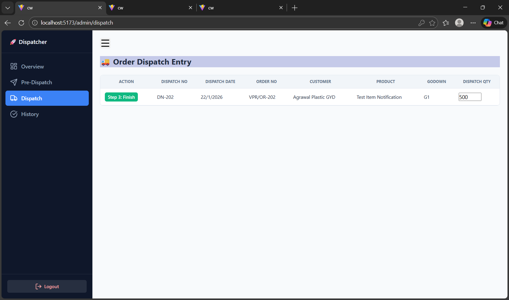
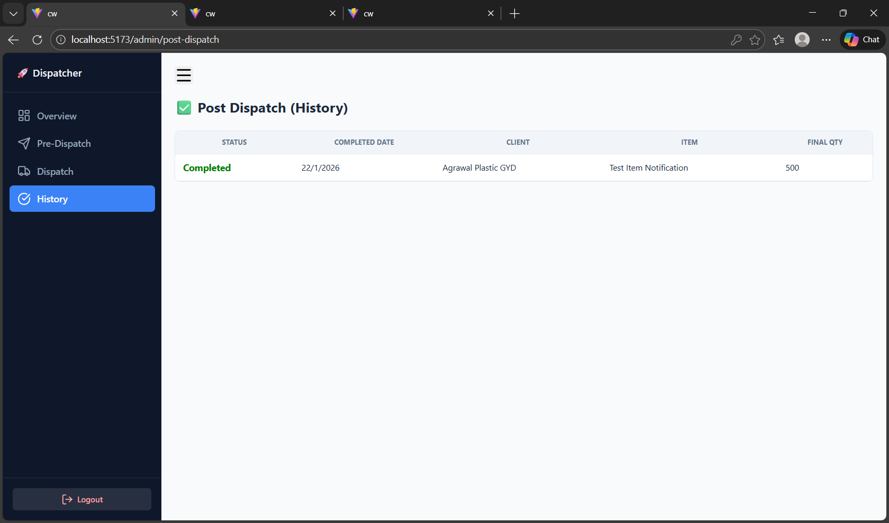
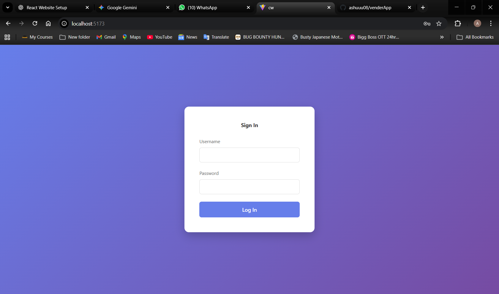

# 📦 Dispatch Management System (DMS)


A role-based **Dispatch Management System** that simulates a full-stack workflow **without a backend**. It uses browser **localStorage** for persistence and demonstrates authentication, order lifecycle management, and admin/client workflows.

---

## 📖 Table of Contents

1. [Key Features](#-key-features)
2. [Order Workflow (Lifecycle)](#-order-workflow-lifecycle)
3. [Architecture & Data Flow](#-architecture--data-flow)
4. [Data Schema (LocalStorage)](#-data-schema-localstorage)
5. [Project Structure](#-project-structure)
6. [Installation & Setup](#-installation--setup)
7. [Login Credentials](#-login-credentials)
8. [Future Roadmap](#-future-roadmap)

---

## 🚀 Key Features

### 👤 Client Portal (User Role)

* **Secure Login:** Role-based access control.
* **Order Entry:** Create orders with item, quantity, and godown selection.
* **Approval Notifications:** Clients approve orders before dispatch.
* **Order History:** Filterable list with status badges.
* **Responsive UI:** Mobile-friendly layout with sidebar navigation.

### 🛡️ Admin Dashboard (Admin Role)

* **Overview:** View all `Pending` orders with quick stats.
* **Pre-Dispatch Planning:** Select and move orders to `Planned`.
* **Client Approval Requests:** Notify clients for approval.
* **Dispatch Management:** Finalize `Ready` orders.
* **Data Control:** Reset local data for demos/testing.

---

## 🔄 Order Workflow (Lifecycle)

1. **`Pending`**

   * Client creates an order.
   * Visible on Admin Overview.
2. **`Planned`**

   * Admin plans selected orders.
   * Visible on Pre-Dispatch.
3. **`Client Approval Pending`**

   * Admin requests client approval.
   * Visible in Client Notifications.
4. **`Ready`**

   * Client approves the order.
   * Visible on Admin Dispatch.
5. **`Completed`**

   * Admin marks as dispatched.
   * Appears in History.

---
## Screenshots












## 🏗 Architecture & Data Flow

* **Frontend:** React + Vite
* **Routing:** `react-router-dom` with protected routes
* **State:** React `useState` / `useEffect`
* **Persistence:** `src/utils/storage.js` (acts as a fake DB)
* **Auth:** LocalStorage-based role/session handling

**Note:** This is a serverless, local-first prototype designed for demos and UI validation.

---

## 💾 Data Schema (LocalStorage)

### `app_users`

```json
[
  { "id": 1, "username": "admin", "password": "123", "role": "admin", "name": "Admin User" },
  { "id": 2, "username": "client", "password": "123", "role": "user", "name": "Agrawal Plastic" }
]
```

### `app_orders`

```json
[
  {
    "id": 17092384,
    "client": "Agrawal Plastic",
    "item": "Parag Ld 51mic",
    "qty": "500",
    "status": "Pending",
    "createdAt": "21/01/2026"
  }
]
```

---

## 📂 Project Structure

```bash
src/
├── components/
│   ├── admin/Sidebar.jsx        # Admin navigation
│   ├── user/UserSidebar.jsx     # Client navigation
│   ├── ProtectedRoute.jsx       # Auth guard
│   └── MobileLayout.jsx         # Responsive wrapper
├── pages/
│   ├── admin/
│   │   ├── Overview.jsx         # Pending orders
│   │   ├── PreDispatch.jsx      # Planned orders
│   │   └── OrderDispatch.jsx    # Ready orders
│   ├── user/
│   │   ├── UserDashboard.jsx
│   │   ├── UserOrders.jsx
│   │   └── UserNotifications.jsx
│   ├── Login.jsx
│   └── OrderEntry.jsx
├── utils/
│   └── storage.js               # LocalStorage data layer
├── App.jsx                      # Routes
└── App.css                      # Global styles
```

---

## ⚡ Installation & Setup

```bash
# Install dependencies
npm install

# Start development server
npm run dev
```

Open: **[http://localhost:5173](http://localhost:5173)** (or the port shown in terminal)

---

## 🔐 Login Credentials

| Role  | Username | Password | Notes                   |
| ----- | -------- | -------- | ----------------------- |
| Admin | admin    | 123      | Full access             |
| User  | client   | 123      | Client: Agrawal Plastic |

---

## 🗺 Future Roadmap

* [ ] Backend API (Node.js / Express)
* [ ] Database (MongoDB / PostgreSQL)
* [ ] JWT Authentication
* [ ] PDF Dispatch Challans
* [ ] Email Notifications

---

Developed wi
